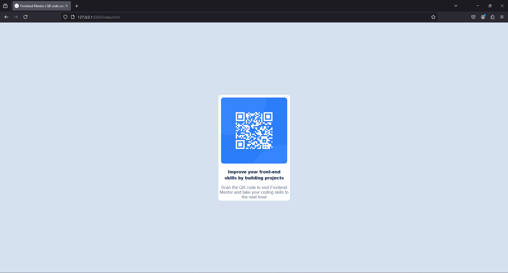

# Frontend Mentor - QR code component solution

This is a solution to the [QR code component challenge on Frontend Mentor](https://www.frontendmentor.io/challenges/qr-code-component-iux_sIO_H). Frontend Mentor challenges help you improve your coding skills by building realistic projects. 

## Table of contents

- [Overview](#overview)
  - [Screenshot](#screenshot)
  - [Links](#links)
- [My process](#my-process)
  - [Built with](#built-with)
  - [What I learned](#what-i-learned)
  - [Continued development](#continued-development)
  - [Useful resources](#useful-resources)
- [Author](#author)

## Overview

- This is my first beginner HTML+CSS practical project, found thanks to the Frontend Mentor platform.

### Screenshot



### Links

- Solution URL: [Github repo](https://github.com/omrilokmen/qr_code_challenge)
- Live Site URL: [Live webpage](https://omrilokmen.github.io/qr_code_challenge/)

## My process
First I had a look at the destination design in order to know what I am going to build, then I started with the simplest things first and went up in difficulty as I worked through them.
below are the technical details:
- The document had the text already I knew I needed to give each of them a class as they both are separate paragraphs, then I added the image using the  tag and gave it a class too, to help with accessibility in CSS.
- At this point I figured out that the only content in this document are these 3 elements and they are in the middle, they also all have a single background color, do I added them all into a single <div> and also gave that a class in order to manipulate its' background color, responsiveness, and position in the page (which is the center)
- I then dug into the CSS part and used the style-guide.md to stylize the text and everything else according to the given design.
- With the help of VS Code and github copilot I was able to generate the CSS code that puts the <div> in the middle of the page while accounting for device size.
- Lastly I had to keep readjusting the <div> and  sizes to fit the required design

### Built with

- Github copilot
- Google fonts API

### What I learned

```html
<div class="qr-code">Group image and text to be able to manipulate them as a block</div>
```
```css
.qr-image {
    border-radius: 10px; /* This can manipulate an img element*/
}
```
```Rules
- Don't use width and height for anything other than tiny icons
- Don't use manual values to manipulate an element's location
```

### Continued development

- I want to continue focusing on responsive design and making elements respond to device size, I am going to study the Copilot part of the code and learn from it.

### Useful resources

- [Google fonts](https://fonts.google.com/) - This helped me with fonts. I really liked the variety of fonts that google provides.

## Author

- Frontend Mentor - [@omrilokmen](https://www.frontendmentor.io/profile/omrilokmen)
- Linkedin - [@lokmen-omri](https://www.linkedin.com/in/lokmen-omri/)